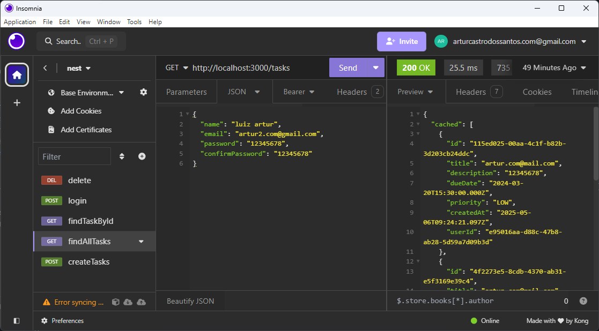
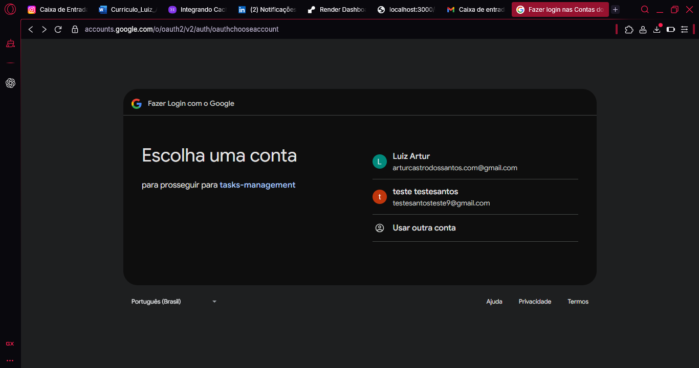
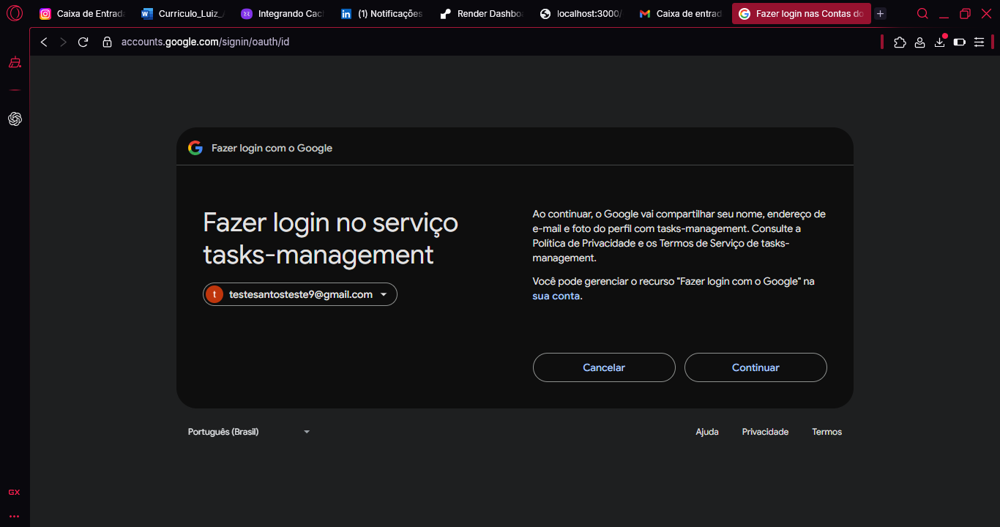
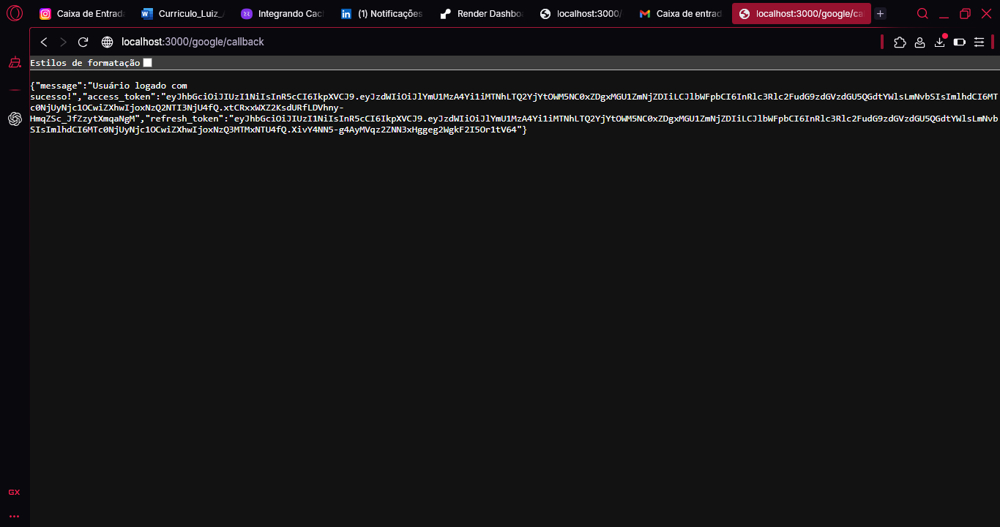
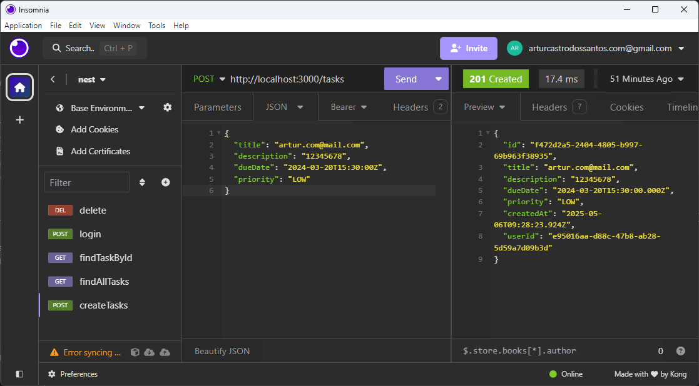

# API de Gerenciamento de Tarefas

Uma API de gerenciamento de tarefas construída com NestJS, apresentando autenticação Google OAuth 2.0, gerenciamento de tokens JWT e cache Redis.

## Demonstração Visual

### 1. Insomnia - Listagem de Tarefas

> Demonstração do endpoint GET `/tasks` utilizando o Insomnia, exibindo a resposta com tarefas armazenadas e cacheadas no Redis. Mostra a integração da API com ferramentas de teste de requisições REST.

### 2. Tela de Login Google OAuth

> Tela de seleção de conta do Google durante o fluxo de autenticação OAuth 2.0, permitindo ao usuário escolher qual conta utilizar para acessar o sistema de gerenciamento de tarefas.

### 3. Consentimento Google OAuth

> Tela de consentimento do Google OAuth 2.0, onde o usuário autoriza o compartilhamento de informações básicas de perfil e e-mail com a aplicação tasks-management.

### 4. Callback de Autenticação Google

> Resposta do endpoint `/google/callback` após autenticação bem-sucedida via Google OAuth 2.0, exibindo mensagem de sucesso e os tokens JWT de acesso e refresh retornados pela API.

### 5. Insomnia - Criação de Tarefa

> Demonstração do endpoint POST `/tasks` no Insomnia, mostrando a criação de uma nova tarefa e a resposta da API com os dados da tarefa criada.


## Principais Funcionalidades

- **Autenticação Google OAuth 2.0**
  - Autenticação segura de usuários usando Google OAuth 2.0
  - Registro automático para usuários que fazem login pela primeira vez
  - Geração de token JWT para sessões autenticadas

- **Autenticação JWT**
  - Tokens de acesso para proteção de rotas da API
  - Mecanismo de refresh token para sessões prolongadas
  - Implementação da estratégia Passport JWT

- **Cache Redis**


- **Gerenciamento de Tarefas**
  - Operações CRUD para tarefas

## Fluxo de Autenticação

1. Usuário inicia login Google OAuth através do endpoint `/google`
2. Após autenticação bem-sucedida, usuário é redirecionado para `/google/callback`
3. Sistema verifica se o usuário existe:
   - Se novo usuário: Cria conta e gera tokens
   - Se usuário existente: Gera novos tokens de acesso e refresh
4. Tokens são retornados ao cliente para chamadas subsequentes à API

## Endpoints da API

### Autenticação
- `GET /google` - Inicia fluxo Google OAuth
- `GET /google/callback` - Manipula callback do Google OAuth

### Tarefas
- `POST /tasks` - Criar nova tarefa
  ```json
  {
    "title": "string",
    "description": "string",
    "dueDate": "2024-01-20", // Data em formato ISO
    "priority": "LOW" | "MEDIUM" | "HIGT"
  }
  ```
- `GET /tasks` - Listar todas as tarefas (com cache Redis)
- `GET /tasks/:id` - Obter tarefa específica
- `PUT /tasks/:id` - Atualizar tarefa (mesmo formato do POST)
- `DELETE /tasks/:id` - Deletar tarefa

## Implementação Técnica

### Segurança
- Rotas protegidas usando `@UseGuards(AuthGuard('jwt'))`
- Geração e validação segura de tokens

### Validação de Dados
- Validação de requisições usando schemas Zod
- DTOs com tipagem segura usando `nestjs-zod`
- Prisma para operações de banco de dados com tipagem segura

## Configuração do Ambiente

A aplicação requer as seguintes variáveis de ambiente:
- Credenciais Google OAuth
- Chaves secretas JWT
- Detalhes de conexão Redis
- String de conexão do banco de dados

## Tecnologias Utilizadas

- NestJS
- Prisma ORM
- Redis
- Passport.js
- Google OAuth 2.0
- JWT
- TypeScript
- Zod

